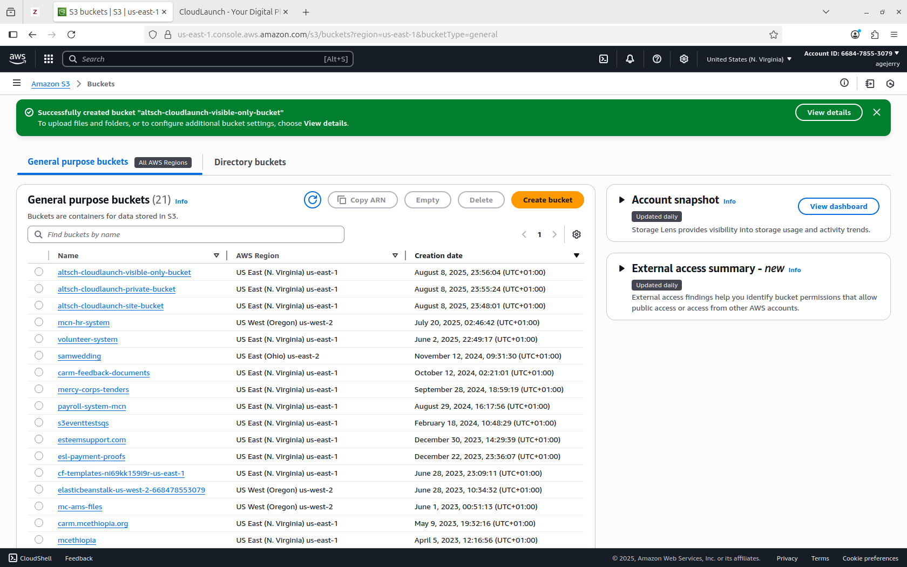
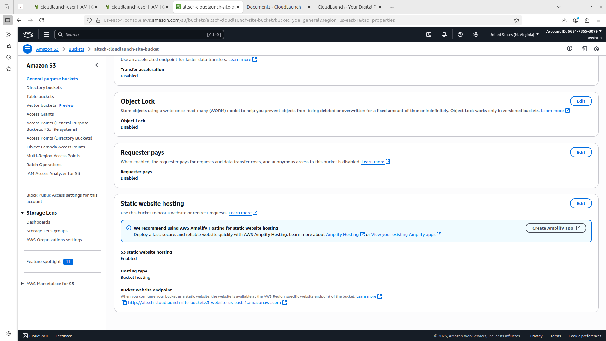
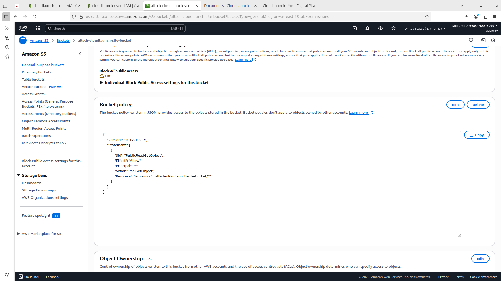
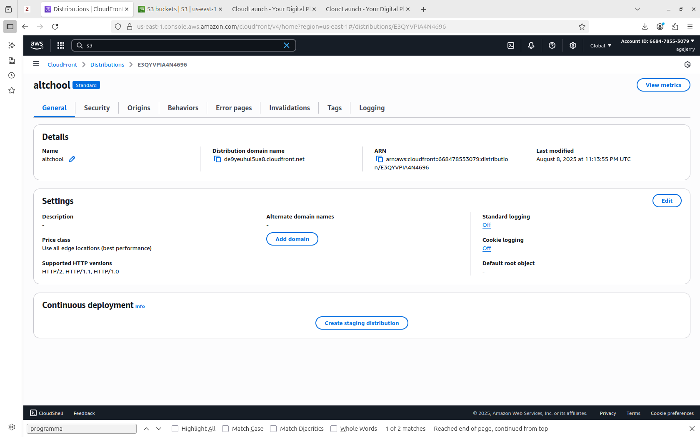
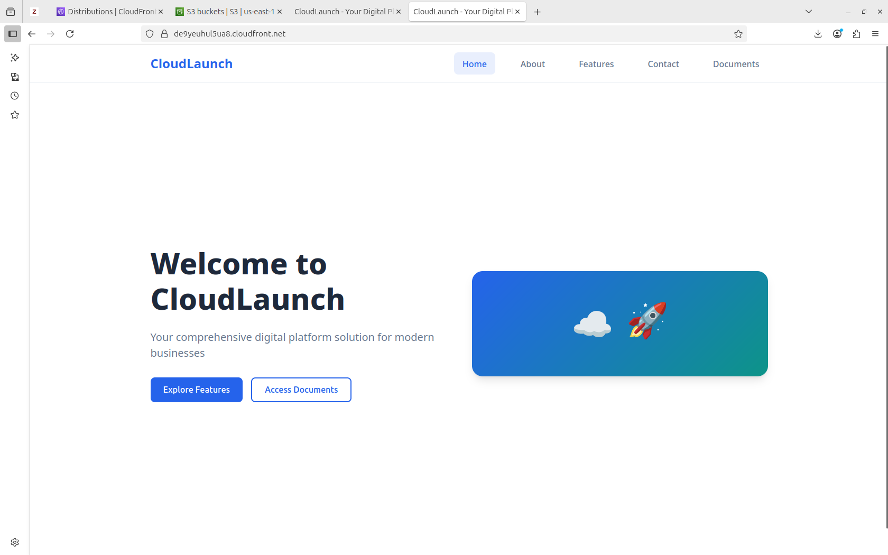
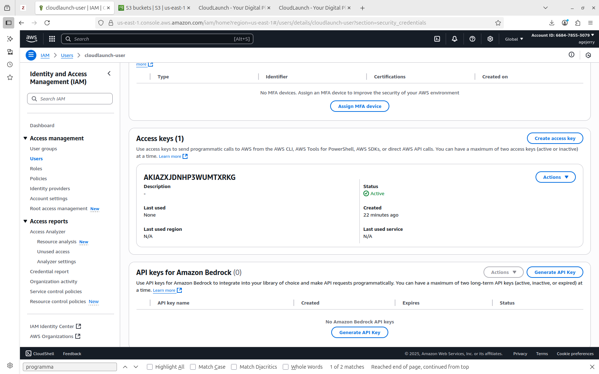
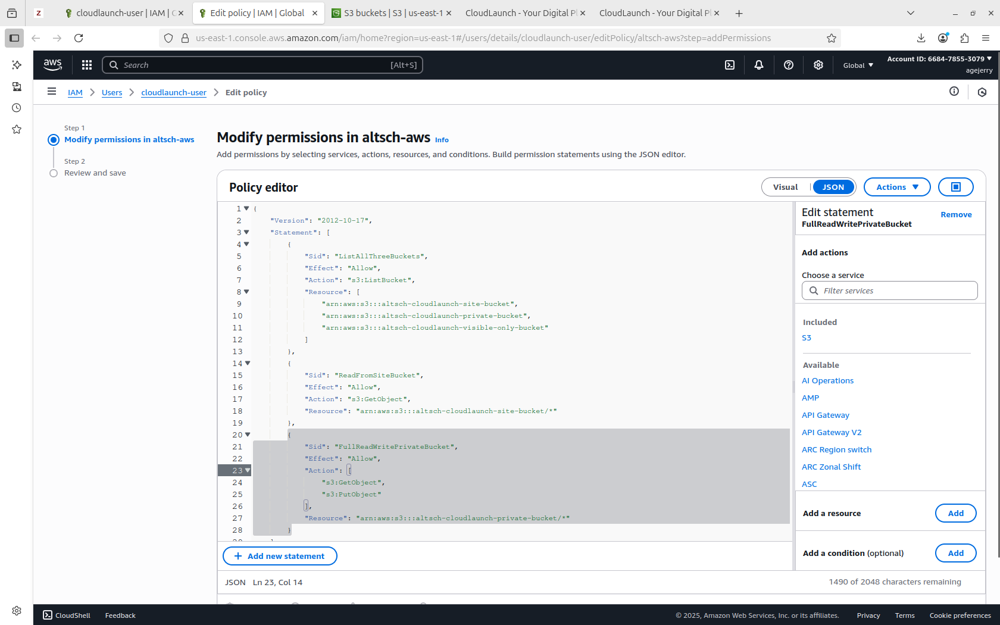
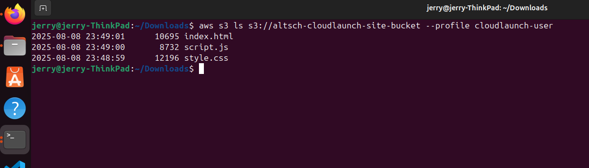

# AltSchool CloudLaunch — Semester 3 Assignment 1 (Cloud)

## Overview
This repository contains the **infrastructure as code** and step-by-step documentation for:

- **Task 1** — Hosting a static website on S3 with IAM-controlled access.  
- **Task 2** — Designing a secure, logically separated VPC for future cloud expansion.

---

## **Task 1 — Static Website Hosting with S3 + IAM User Permissions**

### **1. S3 Buckets Creation**
I created **three S3 buckets**:

| Bucket Name | Purpose | Public? |
|-------------|---------|---------|
| `altsch-cloudlaunch-site-bucket` | Hosts static HTML/CSS/JS files for the CloudLaunch site | ✅ Public Read |
| `altsch-cloudlaunch-private-bucket` | Private file storage (Get/Put only for IAM user) | ❌ |
| `altsch-cloudlaunch-visible-only-bucket` | Visible in S3 list but content not accessible | ❌ |

**Screenshots:**
- 
- 

---

### **2. Static Website Configuration**
- Enabled **Static Website Hosting** on `cloudlaunch-site-bucket`.
- Set **index document** to `index.html`.
- Applied **bucket policy** for public read access.

**Screenshots:**
- 
- 

---

### **3. (Bonus) CloudFront Setup**
- Configured **CloudFront** in front of the S3 bucket for HTTPS and global caching.

**Screenshots:**
-   
- 


---

### **4. IAM User & Policy**
- Created IAM user: `cloudlaunch-user`.
- Attached a **custom JSON policy**:
  - Read-only ListBucket on all three buckets.
  - GetObject on `cloudlaunch-site-bucket`.
  - GetObject/PutObject on `cloudlaunch-private-bucket`.
  - No DeleteObject anywhere.

**Screenshots:**
- 
- 

**IAM Policy JSON:**
```json
{
  "Version": "2012-10-17",
  "Statement": [
    {
      "Effect": "Allow",
      "Action": ["s3:ListAllMyBuckets", "s3:ListBucket"],
      "Resource": [
        "arn:aws:s3:::altsch-cloudlaunch-site-bucket",
        "arn:aws:s3:::altsch-cloudlaunch-private-bucket",
        "arn:aws:s3:::altsch-cloudlaunch-visible-only-bucket"
      ]
    },
    {
      "Effect": "Allow",
      "Action": ["s3:GetObject"],
      "Resource": "arn:aws:s3:::altsch-cloudlaunch-site-bucket/*"
    },
    {
      "Effect": "Allow",
      "Action": ["s3:GetObject", "s3:PutObject"],
      "Resource": "arn:aws:s3:::altsch-cloudlaunch-private-bucket/*"
    }
  ]
}
```
**Screenshots:**
-   
---

**S3 Website Link:**  
```
http://altsch-cloudlaunch-site-bucket.s3-website-us-east-1.amazonaws.com
```

**CloudFront URL:**  
```
https://de9yeuhul5ua8.cloudfront.net/

```

---

## **Task 2 — VPC Design for CloudLaunch Environment**

### **1. VPC & Subnets**
- **VPC:** `cloudlaunch-vpc` — CIDR `10.0.0.0/16`
- **Subnets:**
  - Public: `10.0.1.0/24` — load balancers / public services
  - Application: `10.0.2.0/24` — private app servers
  - Database: `10.0.3.0/28` — private RDS-like services

---

### **2. Internet Gateway & Route Tables**
- **IGW:** `cloudlaunch-igw` (attached to VPC)
- **Route Tables:**
  - Public RT: Default route `0.0.0.0/0` → IGW
  - App RT: No internet route (private)
  - DB RT: No internet route (private)

---

### **3. Security Groups**
- `cloudlaunch-app-sg`: HTTP (TCP/80) allowed **only within VPC**.
- `cloudlaunch-db-sg`: MySQL (TCP/3306) allowed **only from App subnet**.

---

### **4. IAM Permissions for VPC**
**IAM Policy JSON for VPC Read-Only:**
```json
{
  "Version": "2012-10-17",
  "Statement": [
    {
      "Effect": "Allow",
      "Action": [
        "ec2:DescribeVpcs",
        "ec2:DescribeSubnets",
        "ec2:DescribeRouteTables",
        "ec2:DescribeInternetGateways",
        "ec2:DescribeSecurityGroups"
      ],
      "Resource": "*"
    }
  ]
}
```

- `cloudlaunch-user` has **read-only** access to VPC resources.
- No modification rights.

---

## **Repository Structure**
```
terraform/
  main.tf
  variables.tf
iam/
  cloudlaunch-vpc-readonly-policy.json
images/
  s3buckets.png
  s3bucket_files.png
  s3_bucket_conf.png
  s3_bucket_policy.png
  cloudfront.png
  site.png
  iam_cloudfront-user.png
  iam_cloudfront-user_policy.png
README.md
```

---

## **How to Deploy (Terraform)**
```bash
cd terraform
terraform init
terraform plan
terraform apply
```
